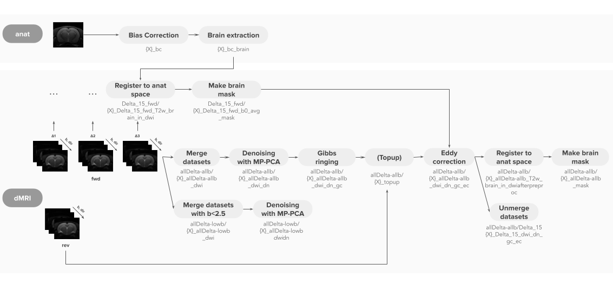
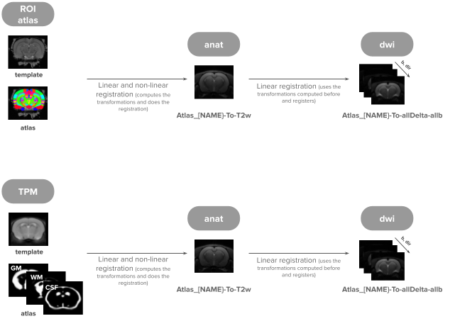

# dMRI-MRS Processing Toolbox

This package includes:
   - Codes to preprocess and analyse dMRI data
   - Codes to preprocess and analyse dMRS(I) data

> 🛠️ **This toolbox is a continuous work in progress.**  
> Please pull the latest changes frequently.  
> If you encounter any issues or have questions, **let us know so we can improve it.**  
> **Contact**: ana.veiga-de-oliveira@chuv.ch

   

## USAGE - dMRI Processing

Download this toolbox to your computer and ensure all dependencies are installed as described below.

This pipeline is designed to process **multi-shell** diffusion data with **multiple diffusion times**, supporting both **Linear Tensor Encoding (LTE)** and **Spherical Tensor Encoding (STE)** for processing and analysis, along with an **anatomical** reference image (T1- or T2-weighted). Several images to control for quality are generated along the processing and saved under (`QA_X`). 

### Instructions:

There are three main scripts for diffusion MRI (dMRI) processing (in `processing_dwi`). Each script corresponds to a specific type of data:

- **Main_rat.py** — For rodent dMRI data  
- **Main_human.py** — For human dMRI data  
- **Main_organoid.py** — For organoid dMRI data

Each script contains the complete pipeline for dMRI preprocessing and analysis, organized into sequential steps.

0. Place your data from the scanner under:
     <pre>
   folder_study_name (name of your project's folder)
       └── raw_data  
         └── studyName_1 (name of the folder created in the MRI)
      </pre>
2. Open the relevant script based on your dataset.
3. Review and customize the parameters of the config structure (`cfg`) at the beginning of the script to suit your experimental setup and processing needs.
4. Run the entire script (not advisable) for full pipeline execution,  
or Run individual steps (e.g., `StepX`) if you want more control or are rerunning specific stages.

### Description of analysis steps:

- **Step1_fill_study_excel**: Fills in a cohort metadata Excel sheet using study info and raw imaging data. Some columns must be pre-filled manually before running the script:
  
> - **newstudyName**: Assigned study name (e.g., `sub-01`, `sub-02`, …)  
> - **studyName**: Name as saved in the MRI system  
>   &nbsp;  • Must match the folder containing this subject’s raw data  
>   &nbsp;  • Should match the name used in the methods file  
> - **Group**: Group number (`1` or `2`, e.g., control vs disease; use `1` if only one group)  
> - **scanNo**: Folder number of raw imaging data (integer)  
> - **acqType**: Acquisition type (`T2W`, `PGSE`, `STE`, `dmrS`)  
> - **blockNo**: Session number (usually `1`, unless it’s a rescan)  
> - **scanQA**: `'ok'` if the data passes a basic quality check (optional)  
> - **Notes**:  Data collected on a Bruker scanner is typically in the orientation:  `x: L→R`, `y: P→A`, `z: I→S`. To match standard atlas orientations, it is recommended to reoriented to: `x: L→R`, `y: S→I`, `z: A→P` (This corresponds to axis flipping as: `x −z y`)
> - **VoxMidHem**: voxel of the mid coronal plane to then define left and right hemispheres. If you don't know or don't care set it to zero and ignore the results of the plots left vs right.
>   &nbsp;      This standard orientation allows easier integration with online atlases and tools.

- **Step2_raw2nii2bids** or **Step2_raw2nii2bids_human**:  
  Converts raw imaging data to NIfTI format and organizes it into [BIDS](https://bids.neuroimaging.io/) format. The directory structure is as follows:
   <pre>  
   folder_study_name
      └── raw_data
         └── studyName_1
         └── studyName_2
         └── ...
      └── nifti_data
         └── unsorted  
                └── newstudyName_1
                └── newstudyName_2
                └── ...
         └── sorted
                └── newstudyName_1
                └── newstudyName_2
                └── ...
      └── derivatives
         └── preprocessed
         └── analysis
   </pre> 
   
   Each `<studyName>` folder must match the names provided in the metadata Excel (`studyName` column). A new folder named `nifti_data` will be created inside `folder_study_name`. where the subfolder `unsorted` contains the converted NIfTI files from Dicomifier with their original names, and the subfolder `sorted` contains the same files organized in BIDS format, with each subject stored under the name specified in the Excel file (newstudyName column)

- **Step2_correct_orientation**: Corrects orientation labels of the nifties that are generated from raw Bruker data in accordance with `Notes` column of the metadata Excel (not needed for human Siemens Scanner). Saves the corrected orientation under 'nifti_data/sorted'.

- **Step3_preproc** : Pre-processes dMRI data of PGSE type together with one anatomical image. Starts from making a copy of 'nifti_data/sorted'. Creates `derivatives/<preprocessed_subfolder>/` (the sub-folder name is set in `cfg`). It runs for:
    1. Combined dataset – all diffusion times merged (ideal to fit models like Nexi) - results are in folder `allDelta_allb`. A subset of the data (with low b values - `allDelta_lowb` - is also denoised to obtain a sigma map that is going to be used for fitting models like Nexi)  
    2. Per diffusion time – each diffusion processed separately (ideal to fit models like DKI or Sandi) - results are in folder `Delta_X_fwd`, with X being the corresponding diffusion time.

   The pipeline used was:
   

- **Step3_preproc_STE** : Pre-processes dMRI data of STE type. Assumes the corresponding anatomical image has already been pre-processed in Step3_preproc. The processing steps are similar to the previous script.  

- **Step3_registrations**: Performs all spatial registrations envolving an atlas or different modalities and creates an `analysis/<analysis_subfolder>/` directory (name set in `cfg`): 
     1. Registers atlas and tissue probability map (TPM) to anatomical space and then to diffusion space  
     2. Register sperical tensor encoding (STE) to one of the linear tensor encoding (LTE) (the LTE diffusion time is chosen in `cfg`)
   
   The pipeline used was:
   

- **Step4_modelling**: Fits micro-structural models and stores outputs in `analysis/<analysis_subfolder>/`. Supported models: *Nexi*, *Sandi*, *Sandix*, *Smex*, *SMI*, (*DTI* and *DKI* are done by default). Does not require Step3_registrations to be done.

- **Step5_get_estimates**: Extracts model estimates within regions of interest. Requires atlas registration from Step3_registrations.

> For a quick analysis don't do **Step3_registration** neither **Step5_get_estimates** and leave cfg['model_list_GM'] and cfg['model_list_WM'] empty so that only DKI model is fit.

  
 
## USAGE - dMRS Processing

(coming soon (in `processing_dmrs`))

  
 
## NOTES

1. Each dataset must include an Excel file with **cohort metadata** (e.g., subject ID, group, scan date).  
Some columns will be automatically filled during **Step1** of the pipeline.  
An example file is provided in the `common` folder.

2. The `common` folder contains essential resources shared across processing pipelines:

- Configuration files for **dMRS fitting**
- Basis dataset for **dMRS fitting**
- A toolbox to convert MRS data from **Bruker format to NIfTI**: `nifti_mrs_from_raw`
- The Anaconda enviroments I used already prepared
- bvals from the STE sequence (which can't be retreived in the methods file) and some placeholder/fake bvecs of that sequence to be able to do some part of the analysis.
- Atlas files for anatomical segmentation and registration:
  - A **template file** (T1- or T2-weighted) → the filename must include `'template'`
  - A corresponding **atlas file** where each region has a number associated to it → the filename must include `'atlas'`
  - A **label file** containing the mapping between the numbers of the atlas and the region names → the filename must include `'labels'`

> Atlases used:  
> - **WHS_v4** for rodents  
> - **DKT** and **Juelich** for humans  
> Contact us if you want to have access to these atlas folders (too large for GitHub)

3. There are some commmon python scripts that support multiple components of the pipeline:

- **`auxiliar_modelling.py`**  
  Auxiliary functions for modeling routines (e.g., fitting options like `nexi`).

- **`bids_structure.py`**  
  Functions for organizing data in BIDS format.

- **`custom_functions.py`**  
  General-purpose helper functions used throughout the pipeline.

   
  
## PREREQUISITES (not provided here)

This package runs in Python and uses Conda to deal with multiple environments.

The following tools must be installed:

- [**RATS_MM**](https://iibi.uiowa.edu/rats-rodent-brain-mri) Add to your system's `PATH` after installation. Need only for brain extraction of rodent data. 

- [**ANTs (Advanced Normalization Tools)**](https://github.com/ANTsX/ANTs) Add to your system's `PATH` after installation. Needed throughout preprocessing.

- [**FSL (FMRIB Software Library)**](https://fsl.fmrib.ox.ac.uk/fsl/docs/#/) Add to your system's `PATH` after installation. Needed throughout preprocessing.

- [**MRtrix3**](https://www.mrtrix.org/) Needed throughout preprocessing.

- [**DESIGNER**](https://nyu-diffusionmri.github.io/DESIGNER-v2/) Needed for denoising and DTI/DKI fitting.

   

These tools should each be installed in their own dedicated Conda environments:

- [**Dicomifier**](https://github.com/lamyj/dicomifier) Environment name: `Dicomifier`; Purpose: Conversion of Bruker data to NIfTI. Only needed for dMRI data acquired with Bruker scanner - on rodents or organoids for example.
 
- [**dcm2niix**](https://github.com/rordenlab/dcm2niix) Environment name: `niix2bids`; Purpose: Conversion of Siemens data to NIfTI. Only needed for dMRI data acquired with human Siemens scanner.

- [**SwissKnife**](https://github.com/QuentinUhl/graymatter_swissknife) Environment name: `SwissKnife`; Purpose: Apply microstructural models to the dMRI data. Needed to apply NEXI, SANDI or SMEX.
  
- [**ANTS**](https://github.com/ANTsX/ANTsPy) Environment name: `ants`; Purpose: ants library in python. Needed to make a nifti of the mrs voxel if dMRS data is present.
 
- [**FSL MRS**](https://open.win.ox.ac.uk/pages/fsl/fsl_mrs/) Environment name: `fsl_mrs`; Purpose: analyze dMRS data

- **Matlab**: with [**MPPCA**](https://github.com/Neurophysics-CFIN/MP-PCA-Denoising) and [**tMPPCA**](https://github.com/Neurophysics-CFIN/Tensor-MP-PCA) toolboxes - required if denosing with the matlab options, but if you don't have matlab you can denoise with mrtrix or designer options (check `Step3.py`); and [**md-dmri-master**](https://github.com/markus-nilsson/md-dmri/tree/master) and [**spm12**](https://www.fil.ion.ucl.ac.uk/spm/software/spm12/) for computation of MicroFA in case STE data was acquired.

   
 
## AUTHORS

Authors: Rita Oliveira & Malte Brammerloh

Supervisor: Ileana Jelescu

Microstructure Mapping Lab (mic-map),
Department of Radiology,
Lausanne University Hospital and University of Lausanne (CHUV),
Rue Pépinet 3, 1003 Lausanne, Switzerland

Email: ana.veiga-de-oliveira@chuv.ch, malte.brammerloh@chuv.ch 

Last updated: June 2025

