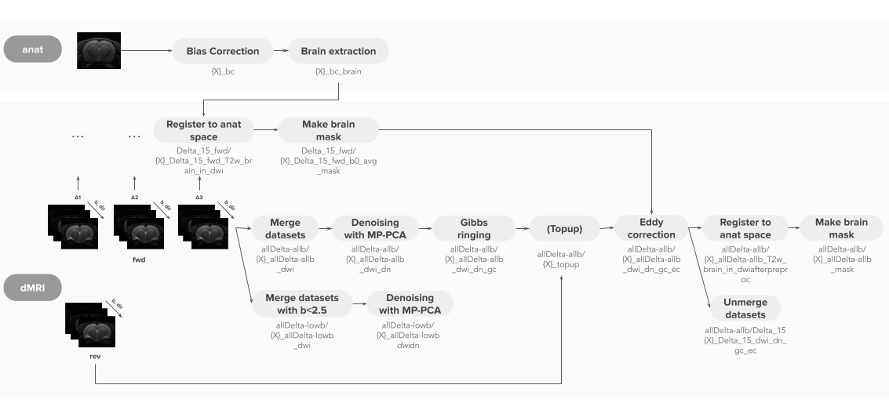
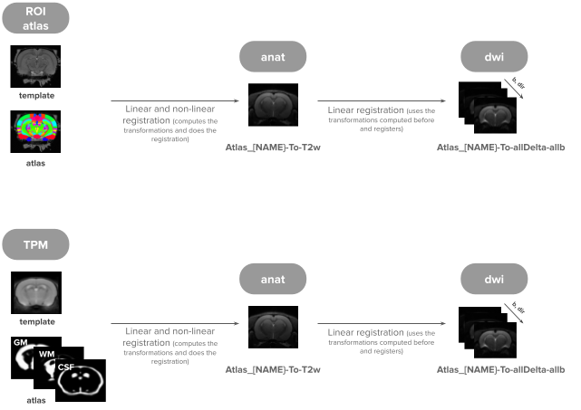

  
# 🔵 dMRI Processing overview
This pipeline is designed to process **multi-shell** diffusion data with **multiple diffusion times**, supporting both **Linear Tensor Encoding (LTE)** and **Spherical Tensor Encoding (STE)** for processing and analysis, along with an **anatomical** reference image (T1- or T2-weighted). Several images to control for quality are generated along the processing and saved under (`QA_X`).

A huge thanks to Andreea Hertanu for providing part of the dwi processing codes!

## 🗒️ Description of analysis steps:
Depending on the level of analysis, run the steps in the following order:

> **Full analysis (with atlas-based ROIs):**  
> Step1 → Step2 → Step2_correct_orientation (Bruker only) → Step3_preproc → Step3_preproc_STE (if applicable) → Step3_registrations → Step4_modelling → Step5_get_estimates  
> **Short analysis (no atlas):**  
> Step1 → Step2 → Step2_correct_orientation (Bruker only) → Step3_preproc → Step4_modelling

- **Step1_fill_study_excel**: Fills in a cohort metadata Excel sheet using study info and raw imaging data. An example file is provided in the `common` folder. 

- **Step2_raw2nii2bids** or **Step2_raw2nii2bids_human**:  
  Converts raw imaging data to NIfTI format and organizes it into [BIDS](https://bids.neuroimaging.io/) format. The directory structure is as follows:
   <pre>  
   folder_study_name
      └── raw_data
         └── raw_data_folder
         └── raw_data_folder
         └── ...
      └── nifti_data
         └── unsorted  
                └── study_name
                └── study_name
                └── ...
         └── sorted
                └── study_name
                └── study_name
                └── ...
      └── derivatives
         └── preprocessed
         └── analysis
   </pre> 
   
   Each `<raw_data_folder>` folder must match the names provided in the metadata Excel (`raw_data_folder` column). A new folder named `nifti_data` will be created inside `folder_study_name`. where the subfolder `unsorted` contains the converted NIfTI files from Dicomifier with their original names, and the subfolder `sorted` contains the same files organized in BIDS format, with each subject stored under the name specified in the Excel file (`study_name` column)

- ~~**Step2_correct_orientation**: Corrects orientation labels of the nifties that are generated from raw Bruker data in accordance with `Reorient` column of the metadata Excel (not needed for human Siemens Scanner). Saves the corrected orientation under `nifti_data/sorted`.~~ Outdated, not recommended.

- **Step3_preproc** : Pre-processes PGSE dMRI data and a single anatomical image. The pipeline starts by creating a copy of `nifti_data/sorted` and generates the output directory `derivatives/<preprocessed_subfolder>/`, where `<preprocessed_subfolder>` is defined in the configuration file (`cfg`).
 
    Processing is performed on the **combined dataset**, in which data from all diffusion times are merged. This combined dataset is stored in the folder: `allDelta_allb`. This combined processed dataset and is well suited for fitting models that exploit multiple diffusion times, such as **NEXI**. In addition, a **subset of the data with low b-values** (<1000) (`allDelta_lowb`) is denoised to estimate a noise (σ) map, which is later used during model fitting (e.g., NEXI).
  
  Finally, data corresponding to **individual diffusion times** are extracted from the combined dataset and stored as: `allDelta_allb/Delta_X` where `X` denotes the diffusion time. This separation ensures that diffusion-time–specific datasets are readily accessible for models such as **DKI**.

   The pipeline used was:
   

- **Step3_preproc_STE** : Pre-processes dMRI data of STE type. Assumes the corresponding anatomical image has already been pre-processed in Step3_preproc. The processing steps are similar to the previous script.  

- **Step3_registrations**: Performs all spatial registrations envolving an atlas or different modalities and creates an `analysis/<analysis_subfolder>/` directory (name set in `cfg`): 
     1. Registers atlas and tissue probability map (TPM) to anatomical space and then to diffusion space  
     2. Register sperical tensor encoding (STE) to one of the linear tensor encoding (LTE) (the LTE diffusion time is chosen in `cfg`)
   
   The pipeline used was:
   

- **Step4_modelling**: Fits micro-structural models and stores outputs in `analysis/<analysis_subfolder>/`. Supported models: *Nexi* (from SwissKnife toolbox), *Sandi* (from SwissKnife toolbox), *Sandi_MP* (from Marco Palombo's Matlab implementation), *Sandix* (from SwissKnife toolbox), *Smex* (from SwissKnife toolbox), *SMI* (from TMI/Designer toolbox), (*DTI* and *DKI* are done by default with TMI/Designer toolbox). Does not require Step3_registrations to be done.

- **Step5_get_estimates**: Extracts model estimates within regions of interest. Requires atlas registration from Step3_registrations.

> For a quick analysis don't do **Step3_registration** neither **Step5_get_estimates** and leave cfg['model_list_GM'] and cfg['model_list_WM'] empty so that only DKI model is fit.

  

 
## 📌 Note on atlas setup 

The use of atlas are optional – only needed for ROI-Based Analysis. To enable ROI-based analysis, prepare atlas files in: `common/atlas` folder and update `atlas_functions.py` accordingly.

### Rodent & Human data: 

- **Standard atlas**
  - Anatomical **template** (T1/T2) → filename contains `template`
  - Labeled **atlas** image → filename contains `atlas`
  - **Label file** (region IDs ↔ names) → filename contains `labels`

- **TPM (tissue probability map) atlas**
  - Anatomical **template** (T1/T2) → filename contains `template`
  - **TPM image** → filename contains `TPM`

### Organoid data:

For **organoid datasets**, ROIs are currently defined using **manually created masks** rather than a predefined atlas.  
See organoid-specific notes in `Main_organoid.py`.

Atlas and TPM files are used during registration and ROI-based parameter extraction (Step3_registrations and Step5_get_estimates).
