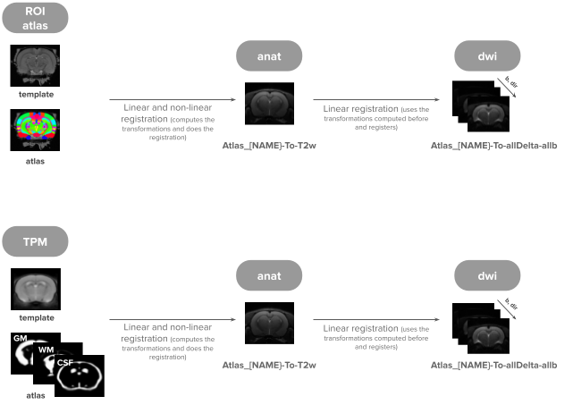

  
# 🔵 dMRI Processing overview
This pipeline is designed to process **multi-shell** diffusion data with **multiple diffusion times**, supporting both **Linear Tensor Encoding (LTE)** and **Spherical Tensor Encoding (STE)** for processing and analysis, along with an **anatomical** reference image (T1- or T2-weighted). Several images to control for quality are generated along the processing and saved under (`QA_X`). 
   
## 🗒️ Description of analysis steps:
Depending on the level of analysis, run the steps in the following order:

> **Full analysis (with atlas-based ROIs):**  
> Step1 → Step2 → Step2_correct_orientation (Bruker only) → Step3_preproc → Step3_preproc_STE (if applicable) → Step3_registrations → Step4_modelling → Step5_get_estimates  
> **Short analysis (no atlas):**  
> Step1 → Step2 → Step2_correct_orientation (Bruker only) → Step3_preproc → Step4_modelling

- **Step1_fill_study_excel**: Fills in a cohort metadata Excel sheet using study info and raw imaging data. An example file is provided in the `common` folder. The following columns must be pre-filled manually before running the script:
  
> - **study_name**: Assigned study name (e.g., `sub-01`, `sub-02`, …)  
> - **raw_data_folder**: Name of the raw data folder saved in the MRI system  
>      • Must match the folder containing this subject’s raw data  
>      • Should match the name used in the methods file
> - **other_name_tag**: (optional) Other name tag, like the rat number or batch...
> - **sex**: (optional) Sex of the subject (`F` or `M`) 
> - **group**: (optional) Group tag (e.g.,`1` or `2`, or `WT`, `disease`) 
> - **scanNo**: Folder number of raw imaging data (integer)  
> - **acqType**: Acquisition type (`T2W`, `PGSE`, `STE`, `dmrS`)  
> - **sessNo**: Session number (usually `1`, unless it’s a rescan)  
> - **Reorient**:  Data collected on a Bruker scanner is typically in the orientation:  `x: L→R`, `y: P→A`, `z: I→S`. To match standard atlas orientations, it is recommended to reoriented to: `x: L→R`, `y: S→I`, `z: A→P` (This corresponds to axis flipping as: `x −z y`)  
>          This standard orientation allows easier integration with online atlases and tools.
> - **VoxMidHem**: voxel of the mid coronal plane in dwi space to then define left and right hemispheres. If you don't know or don't care set it to zero and ignore the results of the plots left vs right.
> - **anat_thr**: intensity threshold to be used as initial guess for the creation of an anatomical brain mask.
> - **Notes**: Notes regarding that specidic subejct/acquisition.
> - **analyse**: 'y' (yes) or 'n' (no) if that row of data is to be analyzed or not (for example if there are repeated scans put that column to 'y' only on the one you want to keep.

- **Step2_raw2nii2bids** or **Step2_raw2nii2bids_human**:  
  Converts raw imaging data to NIfTI format and organizes it into [BIDS](https://bids.neuroimaging.io/) format. The directory structure is as follows:
   <pre>  
   folder_study_name
      └── raw_data
         └── studyName_1
         └── studyName_2
         └── ...
      └── nifti_data
         └── unsorted  
                └── newstudyName_1
                └── newstudyName_2
                └── ...
         └── sorted
                └── newstudyName_1
                └── newstudyName_2
                └── ...
      └── derivatives
         └── preprocessed
         └── analysis
   </pre> 
   
   Each `<studyName>` folder must match the names provided in the metadata Excel (`studyName` column). A new folder named `nifti_data` will be created inside `folder_study_name`. where the subfolder `unsorted` contains the converted NIfTI files from Dicomifier with their original names, and the subfolder `sorted` contains the same files organized in BIDS format, with each subject stored under the name specified in the Excel file (newstudyName column)

- **Step2_correct_orientation**: Corrects orientation labels of the nifties that are generated from raw Bruker data in accordance with `Notes` column of the metadata Excel (not needed for human Siemens Scanner). Saves the corrected orientation under 'nifti_data/sorted'.

- **Step3_preproc** : Pre-processes dMRI data of PGSE type together with one anatomical image. Starts from making a copy of 'nifti_data/sorted'. Creates `derivatives/<preprocessed_subfolder>/` (the sub-folder name is set in `cfg`). It runs for:
    1. Combined dataset – all diffusion times merged (ideal to fit models like Nexi) - results are in folder `allDelta_allb`. A subset of the data (with low b values - `allDelta_lowb` - is also denoised to obtain a sigma map that is going to be used for fitting models like Nexi)  
    2. Per diffusion time – each diffusion processed separately (ideal to fit models like DKI or Sandi) - results are in folder `Delta_X_fwd`, with X being the corresponding diffusion time.

   The pipeline used was:
   

- **Step3_preproc_STE** : Pre-processes dMRI data of STE type. Assumes the corresponding anatomical image has already been pre-processed in Step3_preproc. The processing steps are similar to the previous script.  

- **Step3_registrations**: Performs all spatial registrations envolving an atlas or different modalities and creates an `analysis/<analysis_subfolder>/` directory (name set in `cfg`): 
     1. Registers atlas and tissue probability map (TPM) to anatomical space and then to diffusion space  
     2. Register sperical tensor encoding (STE) to one of the linear tensor encoding (LTE) (the LTE diffusion time is chosen in `cfg`)
   
   The pipeline used was:
   

- **Step4_modelling**: Fits micro-structural models and stores outputs in `analysis/<analysis_subfolder>/`. Supported models: *Nexi*, *Sandi*, *Sandix*, *Smex*, *SMI*, (*DTI* and *DKI* are done by default). Does not require Step3_registrations to be done.

- **Step5_get_estimates**: Extracts model estimates within regions of interest. Requires atlas registration from Step3_registrations.

> For a quick analysis don't do **Step3_registration** neither **Step5_get_estimates** and leave cfg['model_list_GM'] and cfg['model_list_WM'] empty so that only DKI model is fit.

  

 
## 📌 Note on atlas setup 

The use of atlas are optional – only needed for ROI-Based Analysis. To enable ROI-based analysis, prepare atlas files in: `common/atlas` folder and update `atlas_functions.py` accordingly.

### Rodent & Human data: 

- **Standard atlas**
  - Anatomical **template** (T1/T2) → filename contains `template`
  - Labeled **atlas** image → filename contains `atlas`
  - **Label file** (region IDs ↔ names) → filename contains `labels`

- **TPM (tissue probability map) atlas**
  - Anatomical **template** (T1/T2) → filename contains `template`
  - **TPM image** → filename contains `TPM`

### Organoid data:

For **organoid datasets**, ROIs are currently defined using **manually created masks** rather than a predefined atlas.  
See organoid-specific notes in `Main_organoid.py`.

Atlas and TPM files are used during registration and ROI-based parameter extraction (Step3_registrations and Step5_get_estimates).
